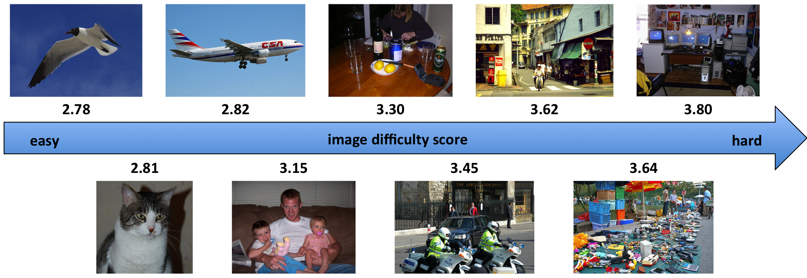

# Visual-Search-Difficulty

This repo is a python version of [Visual Search Difficulty Prediction Model](http://image-difficulty.herokuapp.com/) proposed in paper [How hard can it be? Estimating the difficulty of visual search in an image](http://calvin.inf.ed.ac.uk/wp-content/uploads/Publications/ionescu16cvpr.pdf). The original implementation is of Matlab code.

## Dependency

Feature extraction uses Caffe model, such as `VGG-f`.  So prepare Caffe python interface first.

Regression model uses `nu-SVR`(from sklearn based on libsvm).

Dataset: VOC2012

## Usage

1. Download VGG_CNN_F model of the BMVC-2014 paper: "Return of the Devil in the Details: Delving Deep into Convolutional Nets" [from here](https://gist.github.com/ksimonyan/a32c9063ec8e1118221a#file-readme-md).
2. Compute the CNN features for all the images in PASCAL VOC 2012. Generate pairwise kernel matrix from feature vectors. run `getFeature.py`
3. Train and test regression model
    - train: `SVR.py` 
    - test: `getScore.py`

This method may be used like in paper `Optimizing the Trade-off between Single-Stage and Two-Stage Object Detectors using Image Difficulty Prediction`([arXiv](https://arxiv.org/abs/1803.08707)).

 Notes:
 * Better results can probably be obtained by using a more recent CNN model, such as resnet-152 or vgg-verydeep-16.

## Citation

	Radu Tudor Ionescu, Bogdan Alexe, Marius Leordeanu, Marius Popescu, Dimitrios Papadopoulos, Vittorio Ferrari. How hard can it be? Estimating the difficulty of visual search in an image. Proceedings of CVPR, pp. 2157–2166, 2016.
	
	Soviany, Petru, and Radu Tudor Ionescu. "Optimizing the Trade-off between Single-Stage and Two-Stage Object Detectors using Image Difficulty Prediction." arXiv preprint arXiv:1803.08707 (2018).
	
	Return of the Devil in the Details: Delving Deep into Convolutional Nets. K. Chatfield, K. Simonyan, A. Vedaldi, A. Zisserman British Machine Vision Conference, 2014 (arXiv ref. cs1405.3531)

